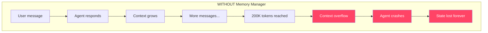
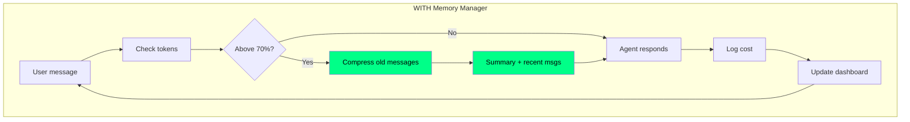
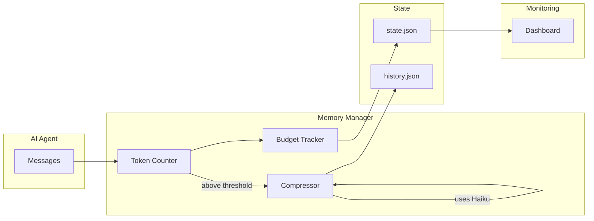

# OpenClaw Memory Manager

**Real-time context monitoring with streaming compression for AI agents.**

Prevents context overflow (the dreaded "prompt too large" error) by tracking token usage, compressing old messages proactively, and providing cost estimates.

## Before: The Problem

Without memory management, AI agents hit context limits unexpectedly:



**Real example:** Lucy tried to spawn 3 expert agents to discuss a problem. All 3 crashed with "Context overflow: prompt too large" — while discussing how to solve context overflow. The irony!

## After: The Solution

With Memory Manager, context is monitored and compressed proactively:



**Compression in action:**

```
BEFORE: [msg1][msg2][msg3][msg4][msg5][msg6][msg7][msg8][msg9][msg10]
              ↑_________old (7 msgs)________↑  ↑__recent (3)__↑
                      128 tokens                   89 tokens
                      
AFTER:  [SUMMARY: discussed Paris, history,  ][msg8][msg9][msg10]
         landmarks, restaurants, best time    
                   ~30 tokens                      89 tokens

SAVED: 98 tokens (76% compression ratio)
```

## Architecture



## Features

- **Token Counter** — Real-time tracking of context usage
- **Streaming Compressor** — Proactive summarization before hitting limits  
- **Budget Tracker** — Cost estimates and alerts
- **Dashboard** — Visual monitoring UI

## Quick Start

### 1. Install dependencies

```bash
pip install -r requirements.txt
```

### 2. Count tokens

```bash
python3 scripts/token_counter.py --text "Your message here"
# {"tokens": 5, "limit": 200000, "percent": 0.0, "warning": "OK"}
```

### 3. Check if compression needed

```bash
python3 scripts/token_counter.py --file history.json --threshold 0.7
# Exit code 1 if above 70% — time to compress!
```

### 4. Compress conversation

```bash
python3 scripts/compressor.py --input history.json --output compressed.json --keep-recent 5
```

### 5. Track costs

```bash
python3 scripts/budget_tracker.py --log-usage --model claude-3-sonnet --input-tokens 5000 --output-tokens 1500
python3 scripts/budget_tracker.py --state state.json
# {"session_cost": 0.04, "daily_cost": 2.45, ...}
```

### 6. Launch dashboard

```bash
python3 scripts/dashboard_server.py --port 8765
# Open http://localhost:8765
```

## Thresholds

| Usage | Warning | Action |
|-------|---------|--------|
| < 70% | OK | Continue |
| 70-80% | MEDIUM | Consider compressing |
| 80-90% | HIGH | Compress now |
| > 90% | CRITICAL | Immediate compression |

## As a Clawdbot/Moltbot Skill

Copy this folder to your skills directory:

```bash
cp -r . ~/.clawdbot/skills/memory-manager/
```

Or add to your Clawdbot config:

```json
{
  "skills": {
    "load": {
      "extraDirs": ["/path/to/openclaw-memory"]
    }
  }
}
```

The skill follows the standard Clawdbot skill format with `SKILL.md` frontmatter.

## Why Haiku for Compression?

| Model | Cost (per 1M input) | Use for |
|-------|---------------------|---------|
| Opus | $15.00 | Complex tasks |
| Sonnet | $3.00 | Normal work |
| **Haiku** | **$0.25** | Compression! |

Compressing 100K tokens with Haiku = **$0.025** (2.5 cents)

## License

MIT License — see [LICENSE](LICENSE)

## Author

Created for the Moltbot/Clawdbot ecosystem.
